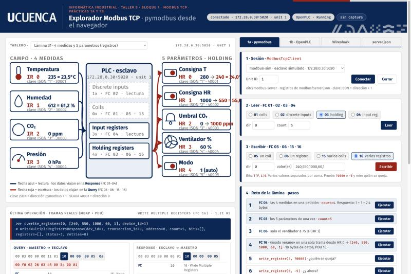

# ot-lab — Laboratorio de redes industriales en Docker

La guía del laboratorio (PDF/LaTeX) se entrega aparte: no forma parte de este repositorio.

## Arranque rápido

Un solo `docker-compose.yml` para macOS, Windows 10/11 y Linux, en Intel/AMD o ARM: Docker elige solo la arquitectura de cada imagen (OpenPLC y Conpot solo existen para amd64 y en ARM corren emuladas). Siga primero los pasos de su sistema y luego:

```bash
docker compose up -d              # la primera vez descarga imágenes y construye modbus-explorer y opcua-py
docker compose ps                 # todos "Up" (Ignition tarda 1-3 min)
docker compose logs -f ignition   # seguir el arranque de un servicio
docker compose down               # detener el laboratorio (los datos se conservan)
```

Servicios web: **Explorador Modbus :8500** · OpenPLC :8080 (openplc/openplc) · Ignition :8088 (admin/lab1234!) · FUXA :1881 · Node-RED :1880 · Conpot :18800 · MQTT :1883 · OPC UA :4840 y :50000 · Modbus :502 y :5020

Desde el PC se entra siempre por `localhost:<puerto>`; las IPs `172.28.0.x` son las que usan los contenedores entre sí (p. ej. `opc.tcp://172.28.0.21:4840/lab/` desde Ignition o FUXA).

### macOS (Intel o Apple Silicon)

1. Instale [Docker Desktop para Mac](https://docs.docker.com/desktop/setup/install/mac-install/) y ábralo (icono de la ballena en la barra de menús).
2. Solo Apple Silicon (M1/M2/M3…): Docker Desktop → **Settings → General → Use Rosetta for x86_64/amd64 emulation** activado. OpenPLC y Conpot corren mucho mejor así.
3. En Terminal:
   ```bash
   git clone https://github.com/Pbarbecho/ot-lab.git
   cd ot-lab
   docker compose up -d
   ```

### Windows 10/11 (Docker Desktop + WSL 2)

1. En PowerShell **como administrador**: `wsl --install` (instala WSL 2 con Ubuntu) y reinicie.
2. Instale [Docker Desktop para Windows](https://docs.docker.com/desktop/setup/install/windows-install/) con la opción **Use WSL 2 based engine**. En **Settings → Resources → WSL integration** active su distribución (Ubuntu).
3. Trabaje **dentro de WSL**: abra *Ubuntu* desde el menú Inicio y clone allí, no en `C:\Users\...` (en NTFS los montajes son lentos y Git puede cambiar los fines de línea):
   ```bash
   git clone https://github.com/Pbarbecho/ot-lab.git ~/ot-lab
   cd ~/ot-lab
   docker compose up -d
   ```
   Desde el Explorador de Windows la carpeta está en `\\wsl$\Ubuntu\home\<usuario>\ot-lab`. Los navegadores de Windows llegan igual a `http://localhost:8500`.
4. Si `docker compose up` falla con *An attempt was made to access a socket in a way forbidden by its access permissions*, el puerto está en un rango reservado por Hyper-V. Compruébelo con `netsh interface ipv4 show excludedportrange protocol=tcp` y, si es el 50000, cambie en `docker-compose.yml` el mapeo de `opc-plc` a `"4850:50000"` (UaExpert: `opc.tcp://localhost:4850`).
5. Los scripts `scripts/*.sh` se ejecutan desde la terminal de Ubuntu (WSL), no desde PowerShell.

### Linux (Ubuntu, Debian, Fedora…)

1. Instale [Docker Engine](https://docs.docker.com/engine/install/) con el plugin `docker compose` (o Docker Desktop para Linux).
2. Para usar `docker` sin `sudo`: `sudo usermod -aG docker $USER` y cierre e inicie sesión.
3. Clone y arranque:
   ```bash
   git clone https://github.com/Pbarbecho/ot-lab.git
   cd ot-lab
   sudo chown -R 1000:1000 nodered-data   # solo si su usuario no es el uid 1000 (compruébelo con: id -u)
   docker compose up -d
   ```
4. En Linux nativo el PC sí alcanza directamente las IPs `172.28.0.x` (en macOS y Windows no).

### Datos y persistencia

- `fuxa-data/` y `nodered-data/`: proyectos de FUXA y flujos de Node-RED en su disco (carpetas locales; no se suben al repositorio).
- Ignition guarda sus datos en el volumen de Docker `ignition-data` (la imagen necesita crear sus archivos iniciales). Respáldelo con *Gateway Backup* (`.gwbk`) desde `http://localhost:8088`.
- `docker compose down` conserva todo; `docker compose down -v` **borra** el volumen de Ignition.

## Explorador Modbus (Taller 5 · prácticas 1a y 1b) · `http://localhost:8500`

Contenedor `modbus-explorer` (172.28.0.40): una web que ejecuta **pymodbus** dentro de la red del laboratorio y muestra lo que viaja por el cable. Arranca con el resto del lab (`docker compose up -d`) y no necesita instalar nada en la laptop.



| Pestaña | Qué hace |
|---|---|
| **Escenario** (arriba a la izquierda) | Vista simple por niveles CIM (Clase 2): Nivel 2 Supervisión (`modbus-explorer`), Nivel 1 Control (`openplc`), Nivel 0 Campo (`modbus-sim`), con el protocolo que cruza cada frontera y la regla «una orden baja, un dato sube». El botón **Detalle** cambia a la réplica de la lámina 18 (laptop, red Docker, puertos, bind mounts). En ambas, los enlaces se iluminan con lo que ocurre (sesión pymodbus, sondeo del PLC cada 100 ms, captura) y cada petición recorre el enlace como un punto. |
| **Tablero** (izquierda) | Arranca vacío, con huecos en gris que se van coloreando a medida que se crean sensores y parámetros en **Modbus server** (primera pestaña). También carga los tableros de las láminas 31, 30 y 21 del Taller 5. Cada lectura o escritura anima un paquete con su FC por la flecha correspondiente, resalta la tabla del esclavo y actualiza las tarjetas (`antes → después` en rojo). |
| **pymodbus** | Sesión `ModbusTcpClient` contra modbus-sim, OpenPLC, Conpot o un host propio. Lecturas FC 01/02/03/04, escrituras FC 05/06/15/16, los pasos del reto de cada lámina con un botón, y sondeo continuo (100 ms – 2 s) como el runtime de OpenPLC. Cada operación muestra la línea pymodbus equivalente, la **Query y la Response reales (MBAP + PDU, byte a byte)**, y la «tabla a entregar» (FC, dónde viajan los datos, PDU, valor) exportable a CSV. Si pymodbus se queja (p. ej. `70000`) se indica que no viajó ninguna trama; si el esclavo responde excepción se decodifica el código. |
| **OpenPLC** | Automatiza el panel de OpenPLC por dentro de la red: **Preparar todo** = Modbus Server en 502 + Slave Device `modbus-sim` (Start 0, DI 2, coils 2, IR 2, HR-R 2, HR-W 0) + subida y compilación del programa + Start PLC. Plantillas editables `monito.st` (ST) y `secuencia_sfc.st` (**SFC**/Grafcet textual: `STEP`, `TRANSITION`, acciones con cualificador `N`). Start/Stop PLC, alta/baja de Slave Devices, **Monitoring embebido** (misma tabla que OpenPLC, leída vía `monitor-update` y pintada en la web) y botón al Monitoring original. Botones para leer el esclavo interno del PLC con pymodbus (`%IX100.0` = DI 800, `%IW100` = IR 100…). |
| **Wireshark** | **Iniciar captura** arranca `tcpdump` dentro del contenedor (puertos 5020 y 502); **Detener** y **Abrir en Wireshark** descargan el `.pcap`, que queda también en `captures/`. Para Wireshark en vivo pegado a un contenedor (láminas 25 y 36) hay un comando para copiar y el script `scripts/wireshark_vivo.sh`. |
| **Modbus server** | Editor gráfico del esclavo simulado: añada entradas digitales, coils, input y holding registers con nombre, icono, formato/escala (×10 °C, %, ppm, hPa, bit…) y valor inicial; cargue los tableros de las láminas 31, 30 y 21 o el `server.json` actual. Los cambios se ven al instante en el tablero animado. **Guardar** escribe `modbus/server.json` (y `modbus/tablero.json` con nombres e iconos); **Guardar y reiniciar modbus-sim** aplica en el simulador a través del socket de Docker montado. Muestra además el `registers` generado y la equivalencia clave JSON → dirección pymodbus → SCADA. |

El socket de Docker (`/var/run/docker.sock`) se monta solo para el botón «Guardar y reiniciar modbus-sim»; si no lo quiere, quite esa línea del compose y reinicie a mano con `docker compose restart modbus-sim`.

Cada bloque de la web lleva una barra con un asa (⠿) para arrastrarlo a la columna izquierda o a otra pestaña (la disposición se guarda en el navegador; «⟲ disposición» la restablece). Los bloques de la izquierda (escenario, tablero, tramas, tabla) tienen «↗ pestaña» para abrirse solos; el «↗ pestaña» de la barra de pestañas abre el panel derecho completo, con sus cuatro pestañas (Modbus server, pymodbus, OpenPLC, Wireshark). Todas las ventanas quedan sincronizadas con la principal: el tablero puede ir al proyector mientras los controles quedan en el portátil. El botón «⇥ auto» de la barra de pestañas convierte la columna derecha en un panel lateral que se oculta solo: queda un riel con los nombres de las pestañas, el panel se despliega al pasar el ratón o pulsar un nombre y se retira al salir («⇤ fijar» devuelve las dos columnas).

Limitaciones honestas: un contenedor no puede abrir ventanas en la laptop, así que «Abrir en Wireshark» descarga el archivo (doble clic lo abre) y la captura en vivo se lanza desde la terminal con el script. El iframe del Monitoring original funciona en Chrome/Edge/Firefox tras iniciar sesión dentro del marco; Safari bloquea esa cookie, use el botón externo.

```bash
./scripts/wireshark_vivo.sh                 # Wireshark en vivo pegado a modbus-sim (ve también el sondeo de OpenPLC)
./scripts/wireshark_vivo.sh openplc         # lo que el PLC envía y recibe (lámina 36)
./scripts/wireshark_vivo.sh modbus-explorer # solo lo que genera la web
docker compose up -d --build modbus-explorer   # tras editar modbus-explorer/
```

Dos trampas de OpenPLC que la web ya esquiva: (1) un Slave Device TCP creado con los campos RTU vacíos hace caer el runtime con *Floating point exception* (la web envía 115200/None/8/1 como el panel); (2) Monitoring toma como variable **cualquier línea con la secuencia espacio-AT-espacio**, comentarios incluidos: evítela en los comentarios del `.st`.

## Estructura
- `docker-compose.yml`          — laboratorio completo, para cualquier SO y arquitectura (platform amd64 solo en openplc/conpot, volumen con nombre para Ignition)
- `modbus-explorer/`            — Explorador Modbus (FastAPI + pymodbus + tcpdump): `app.py`, `static/` (web), `programs/` (plantillas .st para OpenPLC)
- `modbus/server.json`          — registros del esclavo Modbus simulado (clave JSON = dirección + 1); lo escribe el editor «Modbus server» del explorador
- `modbus/tablero.json`         — nombres, iconos y formatos del tablero del editor (lo crea cada estudiante; no se versiona)
- `opcua/`                      — servidor OPC UA propio en Python (asyncua)
- `mosquitto/mosquitto.conf`    — broker MQTT (sin auth, solo laboratorio)
- `scripts/`                    — `comprobacion2_modbus.sh`, `comprobacion3_opcua.sh`, `wireshark_vivo.sh`, `vacio.st`
- `fuxa-data/`, `nodered-data/` — proyectos de FUXA y flujos de Node-RED en el disco local (bind mounts; no se versionan)
- `captures/`                   — volcados pcap (netshoot y el explorador)
- `img/`                        — imágenes del README
- `.gitattributes`              — fuerza LF en configs (imprescindible si se clona en Windows)
