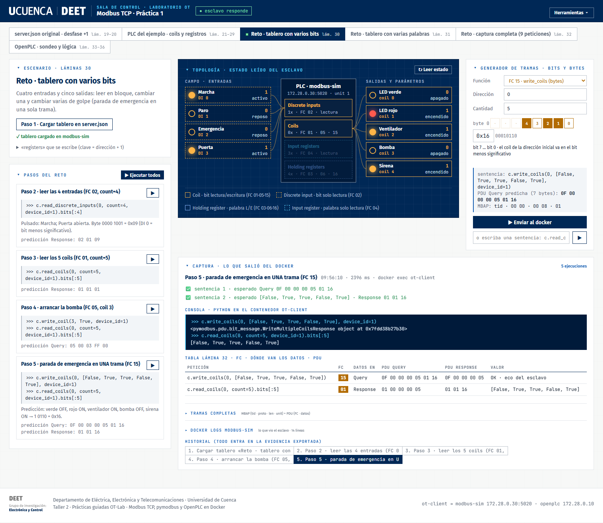
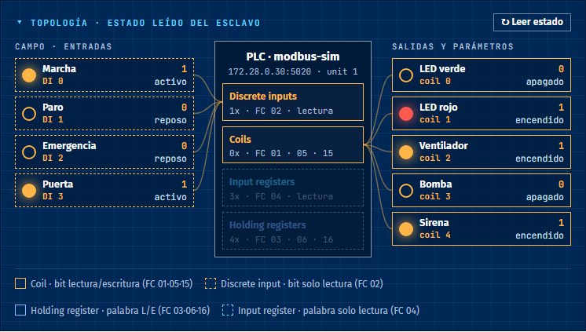
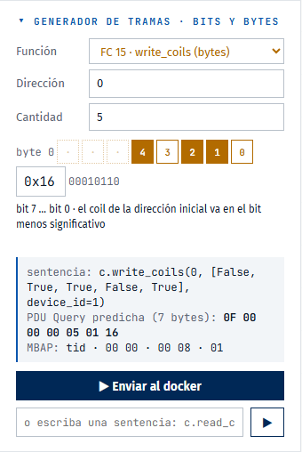
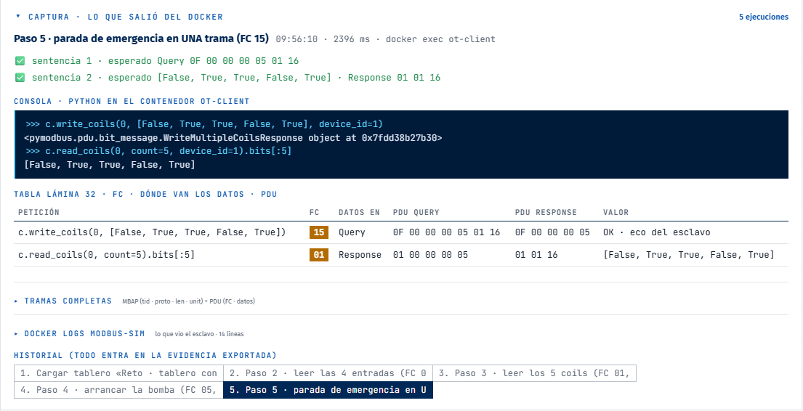
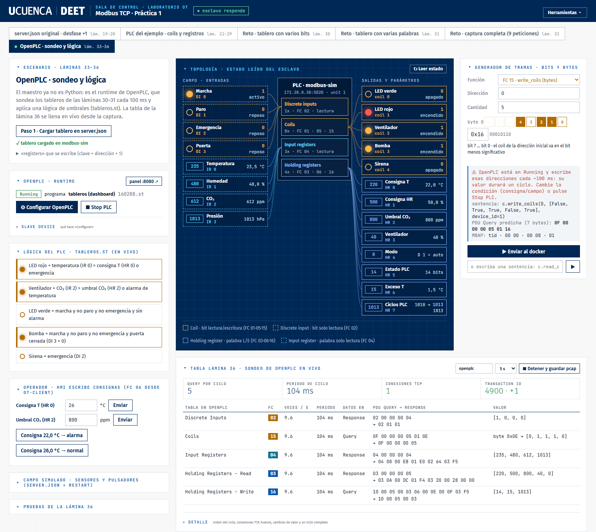
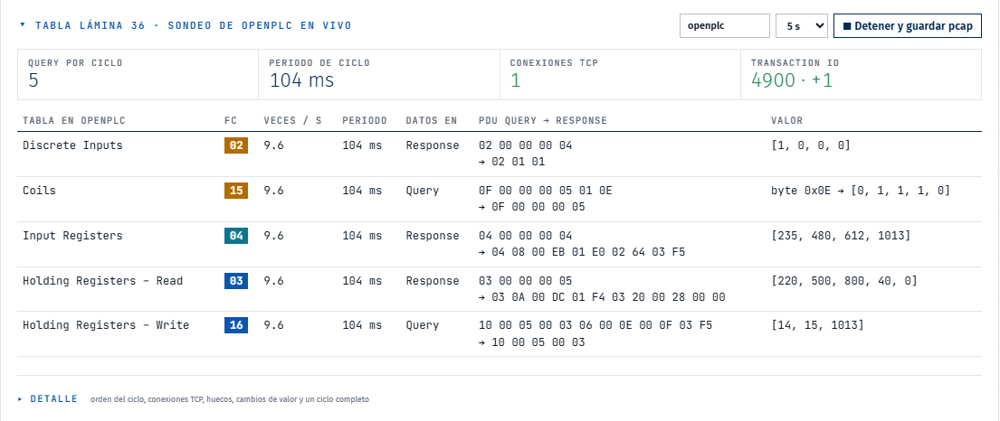

# Dashboard OT-Lab · Práctica 1 (Modbus TCP, pymodbus y OpenPLC)

Panel web que ejecuta las peticiones de la práctica **dentro de Docker** y muestra en el mismo lugar lo que pasó en
el proceso (LEDs, sensores, consignas) y lo que viajó por la red (cada trama Modbus, byte a byte).
Cubre las láminas 19–36 del Taller 2.

> Versión completa, con diagrama y estilo institucional: abra **[README.html](README.html)** en el navegador.



## Arranque

**A · Junto con el laboratorio (recomendada).** Es un servicio más y arranca solo con Docker (`restart: unless-stopped`).
Se **suma** al compose del laboratorio con un segundo `-f`, sin modificarlo:

```bash
# macOS / WSL, desde la carpeta ot-lab
docker compose -f docker-compose.yml -f docker-compose.dashboard.yml up -d --build
# Windows (PowerShell)
docker compose -f docker-compose.windows.yml -f docker-compose.dashboard.yml up -d --build
```

Abrir <http://localhost:8000>. Para quitarlo: `docker compose -f docker-compose.yml -f docker-compose.dashboard.yml rm -sf dashboard`.

**B · En el PC, sin contenedor.** Útil para usar *Abrir Wireshark en vivo*, que necesita abrir una ventana:
`cd ot-lab/dashboard && python app.py` (solo biblioteca estándar + CLI de docker). Usa el mismo puerto: antes `docker stop ot-dashboard`.

La primera vez crea `ot-client` (python:3.12-slim + pymodbus 3.12.1 en la red `ot-lab_ot-lab`, el cliente de la lámina 22) y,
al capturar, descarga `nicolaka/netshoot`.

## Qué hace cada clic

1. `docker exec` de la sentencia pymodbus en `ot-client`: consola `>>>` + tramas reales TX/RX (MBAP + PDU).
2. `docker logs modbus-sim` desde ese instante: lo que vio el esclavo.
3. Lectura de las 4 tablas dentro de `modbus-sim` por loopback (no aparece en la captura): topología.
4. Predicción de la lámina (PDU y valor) contra lo capturado: ✅ / ❌.

Las capturas (Wireshark, *Grabar pcap*, tabla de la lámina 36) usan tcpdump en el **puente de la red ot-lab**, que sobrevive a
«Cargar tablero» (reinicia `modbus-sim`).

## Escenarios

| Láminas | Pestaña | Qué se practica |
|---|---|---|
| 19–20 | server.json original · desfase +1 | La clave «0» es inalcanzable: `[25, 72, 0]` |
| 21–29 | PLC del ejemplo | Coils FC 01/05/15, pulsador FC 02, medidas FC 04, consignas FC 03/06/16 |
| 30 | Reto · varios bits | Byte `0x09` (FC 02) y parada de emergencia en una FC 15 (byte `0x16`) |
| 31 | Reto · varias palabras | Escalas ×10, «modo verano» en FC 16, fuera de rango, desborde a HR 7 |
| 32 | Captura completa | Las 9 peticiones; la tabla de la lámina 32 se llena sola |
| 33–36 | OpenPLC · sondeo y lógica | OpenPLC como maestro cíclico, lógica de umbrales, tabla de la lámina 36 en vivo |

| Topología | Generador de tramas |
|---|---|
|  |  |



## OpenPLC (láminas 33–36)

**Configurar OpenPLC** hace los pasos de la lámina 34 en el panel web: sube y compila `openplc/tableros.st`, crea el Slave Device
(ID 1 · 172.28.0.30:5020 · DI 0/4 · Coils 0/5 · IR 0/4 · HR read 0/5 · HR write 5/3) y hace Start PLC.





Lógica de `tableros.st`:

- **LED rojo** = temperatura (IR 0) > consigna T (HR 0), o emergencia.
- **Ventilador** = CO₂ > umbral, o alarma de temperatura.
- El PLC escribe su estado en HR 5–7 y no pisa las consignas HR 0–4.

> Con el PLC en *Running* las salidas son del PLC: un `write_coil` desde Python dura un ciclo (~100 ms). Cambie la condición
> (consigna con FC 06, o el campo) o pulse **Stop PLC**.

## Evidencia

En el menú **Herramientas**:

- **Exportar evidencia .md**: historial completo en Markdown, con las tablas de las láminas 32 y 36.
- **Grabar pcap**: guarda `ot-lab/captures/<nombre>.pcapng`. El pcap de la tabla en vivo se guarda en `captures/openplc.pcapng`.
- **Wireshark en vivo** (lámina 25): con el dashboard en el contenedor, el botón devuelve el comando para lanzarlo desde WSL:

```bash
docker run --rm --net host nicolaka/netshoot tcpdump -i br-<id de la red ot-lab> -U -w - "tcp port 5020" \
  | wireshark -k -i - -o mbtcp.tcp.port:5020
```

## Integración sin romper nada

- No modifica `docker-compose.yml`, `docker-compose.windows.yml` ni ningún servicio: todo está en `dashboard/` y
  `docker-compose.dashboard.yml`.
- `network_mode: bridge`: no crea redes ni ocupa IPs de 172.28.0.0/24.
- Publicado solo en `127.0.0.1:8000`. El puerto se cambia con `DASHBOARD_PORT`.
- Escribe solo `modbus/server.json` (al cargar un tablero, en LF, con copia `server.json.bak` la primera vez) y `captures/`.
- **Seguridad:** monta `/var/run/docker.sock` y su API ejecuta Python en `ot-client`. Es una herramienta de laboratorio y
  no debe publicarse fuera de `127.0.0.1`.

## Problemas conocidos

| Síntoma | Solución |
|---|---|
| Wireshark: `pcap_loop: The interface disappeared` | La captura estaba en `--net container:modbus-sim` y «Cargar tablero» lo reinició. Capture en el puente (`--net host … -i br-…`). |
| El LED se enciende y se apaga solo | OpenPLC en Running escribe los coils cada 100 ms. |
| `modbus-sim`/`mosquitto` *Exited (127)* tras reiniciar el PC | El laboratorio se levantó desde WSL (rutas `/mnt/c/…`): `wsl -d Ubuntu` y `docker start modbus-sim mosquitto`. |
| Docker deja de responder tras «Abrir Wireshark» | Quedó un `ot-ws` huérfano. El dashboard lo limpia solo; a mano: `docker rm -f ot-ws`. |
| `localhost:8080` muestra otra página | En Windows varios procesos comparten el 8080. El dashboard entra a OpenPLC desde la red Docker. |

## Archivos

```
ot-lab/
├── docker-compose.dashboard.yml   # servicio opcional; se suma con -f
└── dashboard/
    ├── app.py              # servidor HTTP (stdlib) + docker exec/logs/run
    ├── scenarios.py        # escenarios de las láminas 19–36: tableros, pasos y predicciones
    ├── openplc_ctl.py      # panel de OpenPLC + captura en vivo (tabla de la lámina 36)
    ├── index.html          # interfaz (identidad DEET)
    ├── openplc/tableros.st # programa IEC 61131-3 con la lógica de umbrales
    ├── marca/              # logos oficiales UCUENCA | DEET
    ├── Dockerfile
    └── README.md · README.html · docs/img/
```

Para agregar una práctica, añada un diccionario a `SCENARIOS` en `scenarios.py` (`board`, `labels` y `steps` con sus `checks`).
La página se arma sola.
